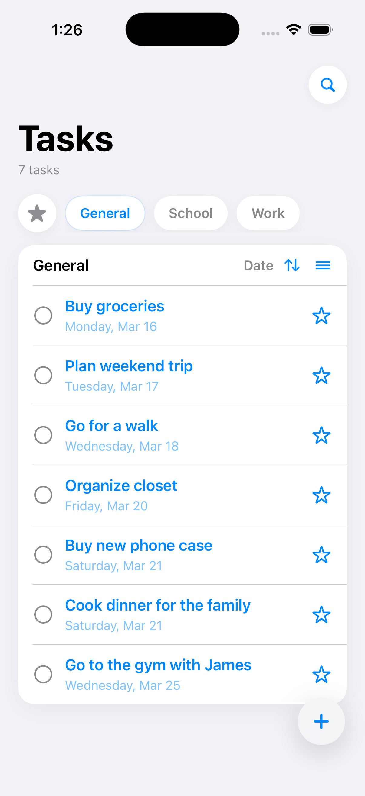
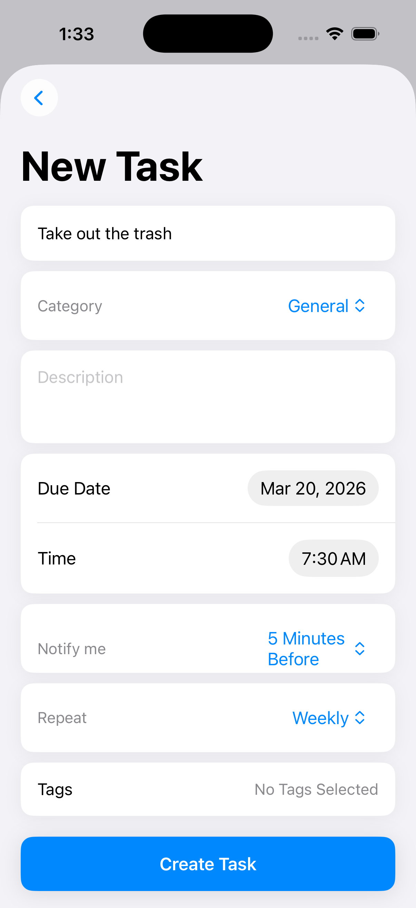
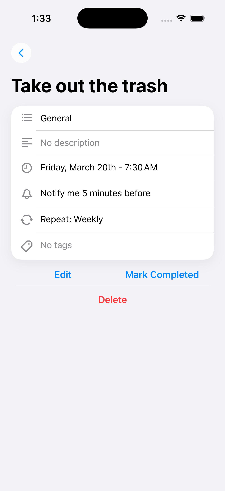

# Taskit - ToDo List Organizer

## Phase 1: Project Proposal
[View the Project Proposal (PDF)](Documentation/Group%2064%20-%20COMP%203097%20-%20Project%20Proposal.pdf)

### This phase outlined:
- Project goals and scope
- Target users
- Core features
- Technology choices
- Initial design considerations

### Requested App Implementations
- Local Storage 
- Notifications

## Phase 2: User Interface & Navigation Design

### This phase focuses on:
- Defining the core app screens
- Designing user navigation flow
- Establishing UI patterns for task creation and management
- Building SwiftUI views using placeholder data (no database)

## Phase 3: Early Prototype

### This phase focused on:
- Core Data persistence
- CRUD operations
- UI enhancements

## Phase 4: Final Implmentation

### This phase will focus on:
- Local notification development
- Task category management
- Final UI enhancements
- Bug fixing
- Lab PC compatability fixes

### Tasks View
The Tasks View lists all the user's tasks with the option to view tasks categorically, by predefined filters, or search queries. Each task has their own completion button and favourite button which allows for easy management. 

### New Task / Edit Task Views
The New Task and Edit Task Views provide a form for creating or modifying a task, with fields for title, category, description, due date, time, notification preferences, repeat rules, and tags.

### Task Details View
The Task Details View displays the full information of a selected task, including its title, category, description, due date, notification preference, repeat rule, and tags. The view also includes options to edit, mark as completed, or delete the task.

## Xcode Version Compatability Challenge
During development, we were faced with a compatability error where the Taskit project files were unable to be run on College lab computers. This was due to the project being created on a Cloud Mac using Xcode version 26.3, incompatible with the lab computers Xcode IDE running on version 14.2. This required the project to be downgraded to a version that could be accessed by both environments. Unfortunatley downgrading the project was more difficult than anticipated and so the solution was to rebuild the project from the ground up and copy the last working commit to the new project.

